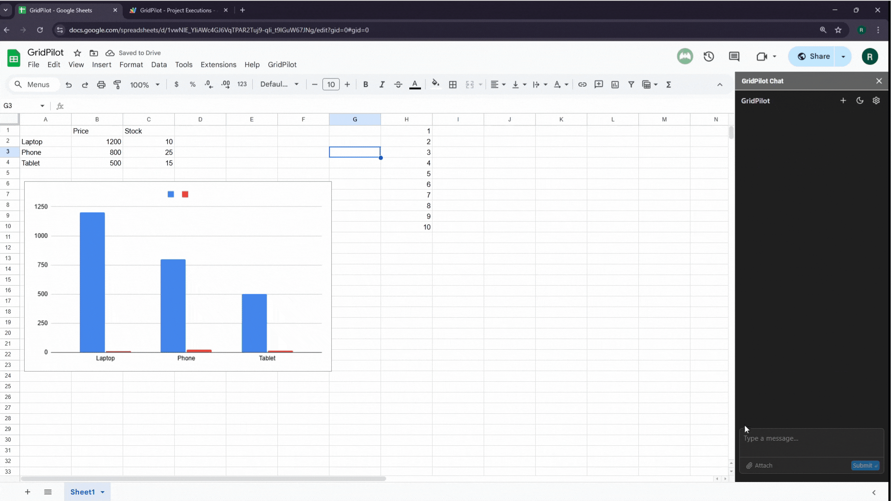
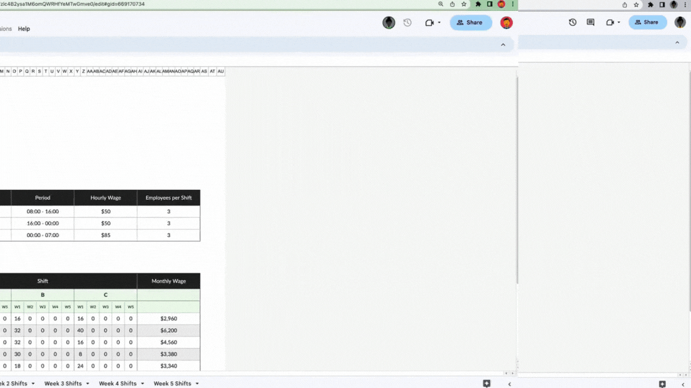
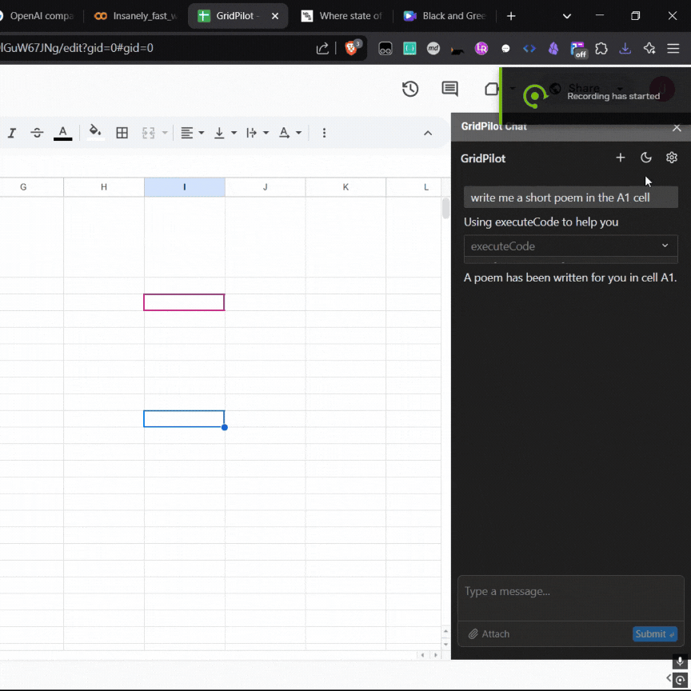

# GridPilot 📊

An AI-powered assistant for Google Sheets that helps you analyze data, create reports, and access real-time information through natural language conversations.

## Table of Contents 📑
- [Overview](#overview-)
- [Features](#features-)
- [Installation](#installation-)
  - [Easy Installation](#easy-installation)
  - [Manual Installation](#manual-installation)
- [Usage](#usage-)
- [Technical Details](#technical-details-)
- [Security](#security-)
- [Contributing](#contributing-)
- [Support](#support-)
- [License](#license-)
- [Support Us](#support-us-)

## Overview 🌟

GridPilot integrates directly into Google Sheets as a sidebar chat interface, allowing you to:
- Query your spreadsheet data naturally
- Access real-time information like weather and web search results
- Generate reports and visualizations
- Automate spreadsheet tasks through conversation

## Features 🚀

- **Smart Chat Interface** 💬
  - Persistent chat history
  - Context-aware conversations
  - Custom instructions support
  - Powered by IBM Granite AI

- **Integrated Tools** 🛠️
  - Web search capabilities via Tavily API
  - Spreadsheet data analysis
  - Report generation

- **Easy Setup** ⚡
  - Simple one-click installation
  - Custom menu integration
  - User-specific settings
  - Secure API key management

## Installation 🔧

### Easy Installation

1. **Open Google Sheet Demo Sample** -> [Here](https://docs.google.com/spreadsheets/d/1vwNlE_YIiAWc4GJ6VqTPAR2Tuj9-qIi_t9lGuW67JNg/edit?usp=sharing)

2. **Make a copy of the sheet**

3. **Click on the GridPilot Menu Tab -> Open Chat**

4. **Give all the permissions**

5. **Setup all the API keys**

6. **Start Chatting**

### Manual Installation

1. **Open your Google Sheet**

2. **Add GridPilot to your spreadsheet:**
   - Open Extensions > Apps Script
   - Copy the project files into your Apps Script editor
   - Save all files

3. **Configure API Keys:**
   - Get an IBM Cloud API key
   - Get a Tavily API key for web search
   - Configure them in the GridPilot settings

## Usage 📝

1. **Access GridPilot:**
   - Open your spreadsheet
   - Click the "GridPilot" menu
   - Select "Open Chat"

2. **Initial Setup:**
   - Enter your API keys
   - Configure custom instructions (optional)
   - Choose your preferred AI model

3. **Start Using:**
   - Type natural language queries in the chat
   - Ask for data analysis
   - Request web searches

## Technical Details 💻

- **Platform:** Google Apps Script
- **AI Model:** IBM Granite 3.8B Instruct
- **APIs:**
  - IBM Cloud API
  - Tavily Search API
  - Weather API
- **Storage:** Google Apps Script Properties Service

## Security 🔒

- API keys stored securely in user properties
- Token-based authentication
- Automatic token refresh
- User-specific settings and history

## Contributing 🤝

Interested in contributing? Here's how you can help:

1. Fork the repository
2. Create a feature branch
3. Submit a pull request

## Support 💪

For support, please:
- Check the documentation
- Open an issue in the repository
- Contact the development team

## License 📄

This project is licensed under the MIT License - see the LICENSE file for details.

## Support Us ❤️

If you find GridPilot helpful in your work and would like to support its development, consider buying us a coffee! Your support helps maintain and improve this tool.

Your contributions help us continue developing features and maintaining GridPilot for the community.

---

Made with ❤️ for Google Sheets users
